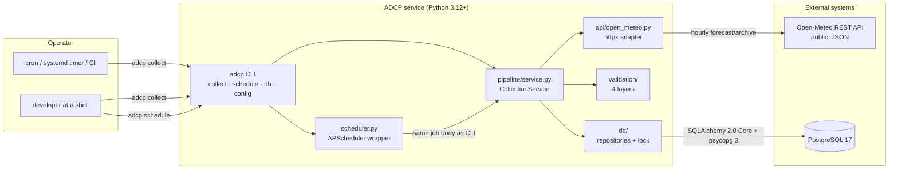
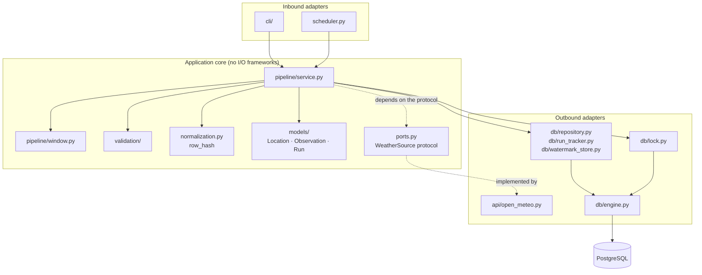
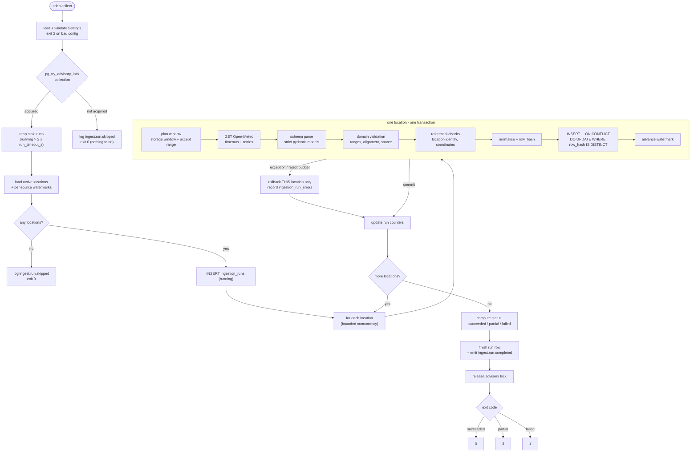
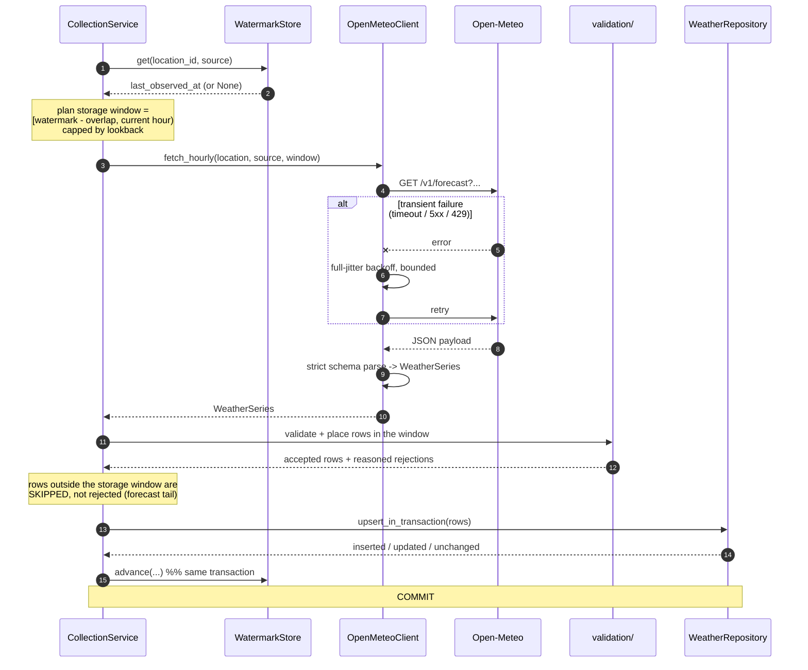
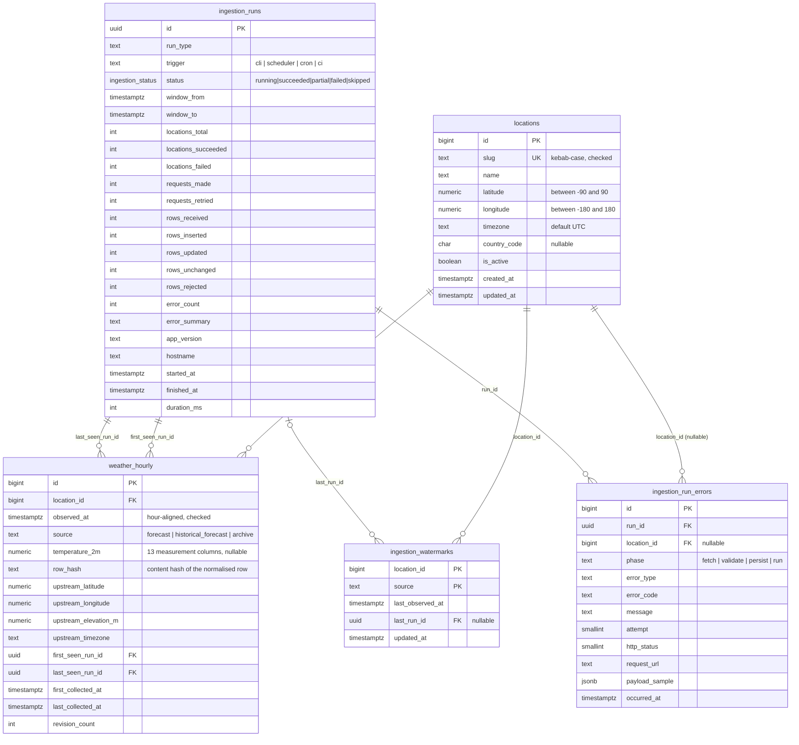
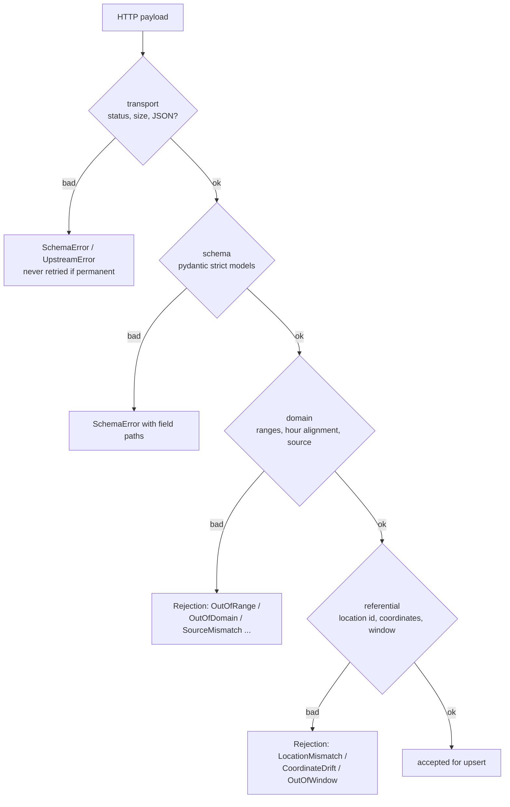
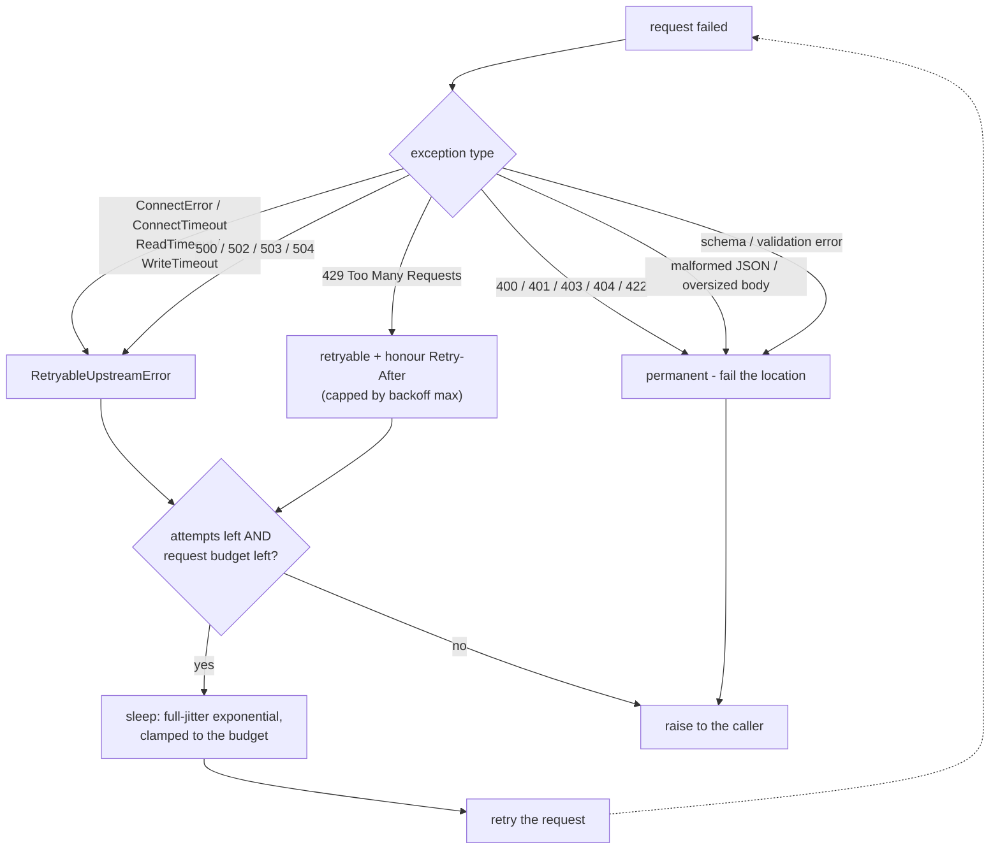
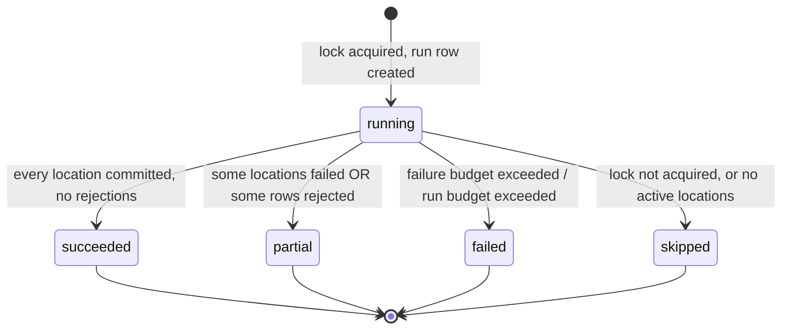
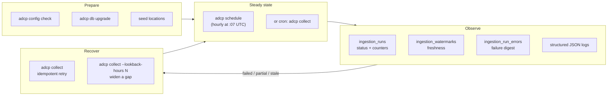

# Architecture

This document is the visual companion to [`PLAN.md`](PLAN.md). The plan is the
source of truth for *why*; this file shows *what the code looks like* and *what
happens, in order, during a run*. Every diagram is Mermaid, so GitHub renders it
without any build step.

**Related:** [README](../README.md) · [PORTFOLIO](PORTFOLIO.md) ·
[DEMO](DEMO.md) · [RUNBOOK](RUNBOOK.md) · [queries.sql](queries.sql)

---

## 1. System context



The CLI never talks to the API or the database directly: it composes settings,
the adapter, and the service, then maps the returned `RunSummary` to an exit
code. That keeps one collection path for manual runs, scheduled runs, and tests.

---

## 2. Layering (ports and adapters)



Two rules are enforced by `tests/test_architecture.py` rather than by convention:

1. `adcp.api` must not import `adcp.db` - the client can be exercised without a
   database, and a database outage cannot change request construction.
2. HTTP is confined to `adcp.api` and `adcp.resilience` - no other module opens a
   connection.

---

## 3. Data flow: one `adcp collect` run



The three properties worth calling out:

- **Per-location transactions.** `_persist()` opens one transaction per location.
  A failure rolls back that location's rows *and* its watermark; every other
  location that already committed stays committed.
- **Watermark after commit only.** `watermark_store.advance()` runs inside the
  same transaction as the upsert, so the cursor can never point past data that
  was rolled back.
- **Lock first, everything else second.** A second process (or an overlapping
  scheduler tick) fails fast with `ingest.run.skipped` instead of double-writing.

---

## 4. Sequence: one location



---

## 5. Database schema

Five tables; `weather_hourly` is the fact table and the other four are the
configuration, audit, and cursor tables around it. The DDL in
[`PLAN.md`](PLAN.md#5-postgresql-schema) section 5 is the source of truth, and
`src/adcp/db/tables.py` mirrors it so `alembic check` can detect drift.



### The natural key and the no-op upsert

`weather_hourly_natural_key` is `(location_id, observed_at, source)`. Because
`source` is part of the key, a **forecast** and an **archive** observation of the
same hour coexist instead of overwriting each other. The write is:

```sql
INSERT INTO weather_hourly (...) VALUES (...)
ON CONFLICT (location_id, observed_at, source) DO UPDATE
   SET ...
 WHERE weather_hourly.row_hash IS DISTINCT FROM EXCLUDED.row_hash;
```

The `WHERE` clause is what makes a re-run a *true storage no-op*: identical data
produces no update, so `last_collected_at` and `revision_count` are untouched -
not merely rewritten with the same values.

---

## 6. The incremental window

Two different windows are involved, and conflating them is how a pipeline either
loses data or rejects half of every payload:

```mermaid
flowchart LR
    subgraph timeline["UTC timeline (current hour = 12:00, lookback 3h, overlap 2h)"]
        direction LR
        past["accept range start<br/>= start of day - past_days"]
        wm["watermark<br/>11:00"]
        start["storage start<br/>max(11:00 - 2h, 12:00 - 3h) = 09:00"]
        end["storage end<br/>12:00 (exclusive)"]
        future["accept range end<br/>= start of day + 1 day"]
    end
```

| Region | Classification | Why |
| --- | --- | --- |
| `[storage_start, storage_end)` | **stored** | completed hours this run may write |
| inside the accept range, outside the storage window | **skipped** | the forecast tail and the already-covered hours; the next run will observe them properly |
| outside the accept range | **rejected** (`OutOfWindow`) | the provider returned something we never asked for - a bug, not noise |

The storage window's start is `watermark - overlap`, capped by
`now - lookback`. That is why the overlap setting is the lever for re-reading
recent hours after a model revision, while `lookback` caps how far back a first
run (or a gap recovery) may reach.

---

## 7. Validation layers

Rows move through four layers; the first failure that applies decides whether the
row is rejected, and every rejection carries a machine-readable code.



Transport and schema failures fail the whole fetch (the payload cannot be
trusted). Domain and referential failures reject individual rows but let the rest
of the location commit - subject to the per-location reject budget
(`ADCP_INGEST_MAX_INVALID_ROW_RATIO`, default 25%). Above the budget the location
rolls back entirely, which is what stops a bad provider response from half-filling
the table.

---

## 8. Failure and retry behaviour

### Client-level classification



Only `RetryableUpstreamError` is retried. Malformed requests, invalid
configuration, schema/semantic validation errors, and 4xx responses are never
retried, because waiting cannot make them true.

### Run-level behaviour



| Situation | Behaviour | Exit code |
| --- | --- | --- |
| Everything commits, nothing rejected | `succeeded` | 0 |
| Lock held by another process | no run row, `ingest.run.skipped` | 0 |
| No active locations | no run row, `ingest.run.skipped` | 0 |
| Some locations fail, others commit | `partial`, failed locations get error rows | 3 |
| Rejections inside the per-location budget | `partial` | 3 |
| More than `ADCP_INGEST_FAILURE_BUDGET_RATIO` of locations fail | `failed` | 1 |
| Run wall-clock budget exhausted | `failed`, `RunTimeoutExceeded`; committed locations survive | 1 |
| Database unreachable | clean one-line error | 1 |
| Invalid flag value or unknown location | clean one-line error | 2 |
| `Ctrl+C` | interrupts, cleans up | 130 |

Full catalogue, including the F1-F17 failure identifiers: [`PLAN.md`](PLAN.md#11-failure-and-partial-failure-behaviour)
section 11.

---

## 9. Operational workflow



The recovery step is deliberately boring: because writes are idempotent and the
watermark only moves on commit, "run it again" is always safe, and widening the
lookback re-reads more history without duplicating anything. The step-by-step
operator procedure is in [`RUNBOOK.md`](RUNBOOK.md).

---

## 10. Where each concern lives

| Concern | Module |
| --- | --- |
| Configuration and validation | `src/adcp/config.py` |
| CLI assembly and exit codes | `src/adcp/cli/`, `src/adcp/exit_codes.py` |
| HTTP client and retry policy | `src/adcp/api/open_meteo.py`, `src/adcp/resilience.py` |
| Wire models and request construction | `src/adcp/api/schemas.py`, `src/adcp/api/requests.py`, `src/adcp/api/mapping.py` |
| Domain models | `src/adcp/models/` |
| Validation layers | `src/adcp/validation/` |
| Canonical values and `row_hash` | `src/adcp/normalization.py` |
| Run orchestration | `src/adcp/pipeline/service.py` |
| Window planning | `src/adcp/pipeline/window.py` |
| Schema and upserts | `src/adcp/db/tables.py`, `src/adcp/db/repository.py` |
| Run tracking | `src/adcp/db/run_tracker.py` |
| Watermarks | `src/adcp/db/watermark_store.py` |
| Advisory lock | `src/adcp/db/lock.py` |
| Migrations | `src/adcp/db/migrations/` |
| Scheduling | `src/adcp/scheduler.py` |
| Structured logging and redaction | `src/adcp/logging.py` |
